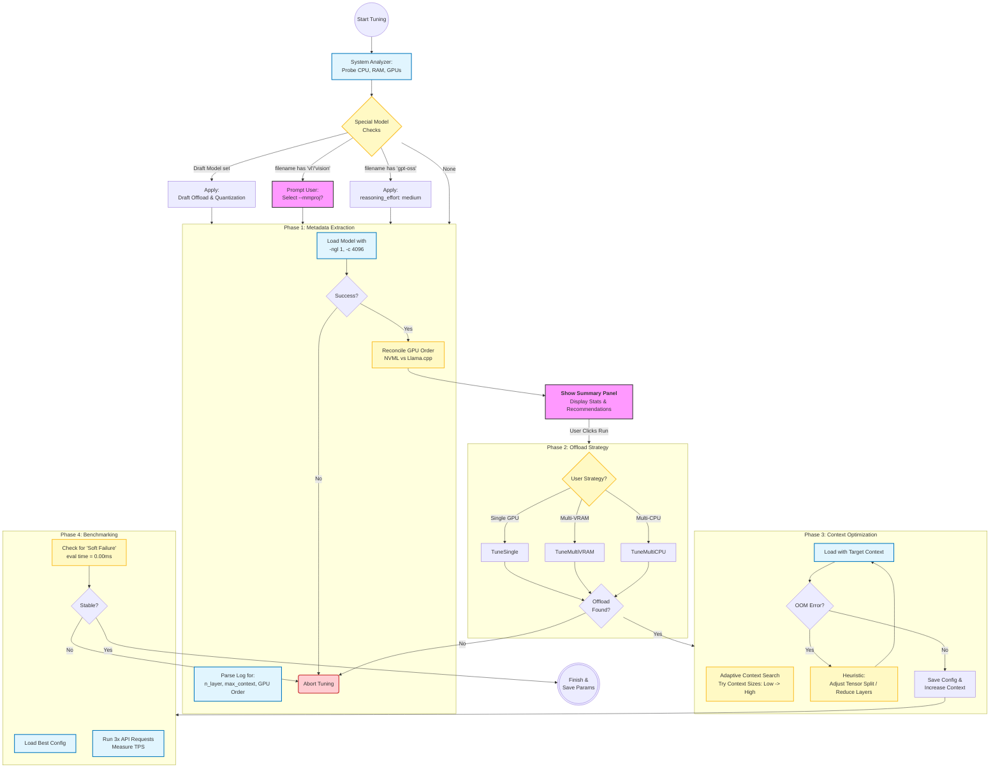
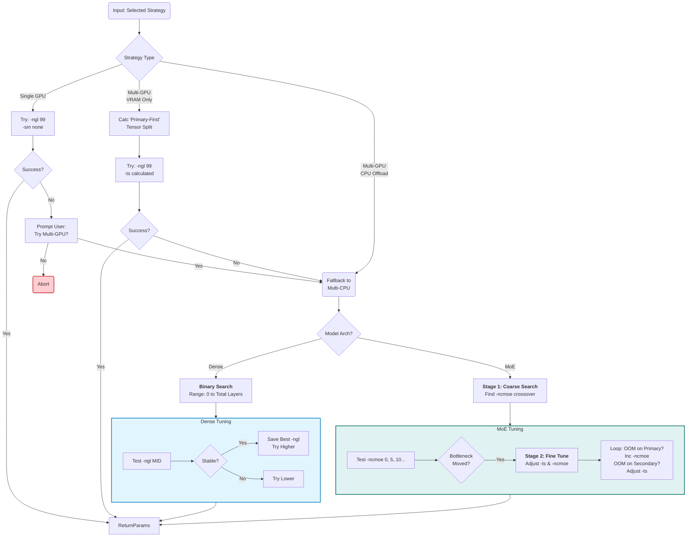
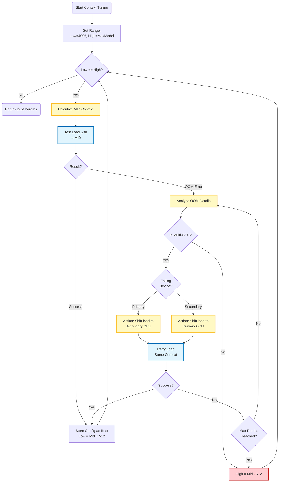

Llamacpp-Model-Launcher

The Llamacpp-Model-Launcher is a desktop application designed to simplify the process of managing and running your language models. It replaces the need for typing lengthy and complex commands into a terminal with an intuitive, point-and-click interface. You can easily manage, edit, delete, duplicate, and run all your language models.

Please Note: This application was developed for Windows and has not been tested on other operating systems.


Features
<details>
<summary><strong>✅ Core Functionality & Model Management</strong></summary>


*   Graphical Front-End: A robust and intuitive GUI for managing and launching llama-server.exe instances.

*   One-Click Model Loading: Load and unload models with a single click, eliminating manual command-line work.

*   Centralized Dashboard: Manage all your model configurations from a single, organized interface.

*   Add, Duplicate, Delete: Easily create new configurations from a template, duplicate existing ones to experiment, or delete them safely with a confirmation prompt.

*   Save to File: All changes are saved to your models.txt file, keeping your configurations portable and easy to back up.

*   Reset Changes: Instantly discard any unsaved modifications and revert to the last saved state.

</details>

<details>
<summary><strong>⚙️ Powerful Parameter Editing & Discovery</strong></summary>


*   Interactive Parameter Browser: A built-in, searchable library of Llama.cpp parameters, complete with descriptions and organized into collapsible categories (e.g., Sampling, GPU, Context).
	*   thanks https://x.com/unmortan for the info/code/design inspiration
	*   https://www.reddit.com/r/LocalLLaMA/comments/1opx9k2/comment/nnf2gr9/?context=1

*   One-Click Parameter Addition: Add parameters from the browser to your model with a single click.

*   Live Search & Filtering: Instantly find parameters by name, description, or command-line flag (e.g., --top-k).

*   Dynamic Parameter Editor: The editor automatically provides the right tool for each parameter, including text fields, checkboxes, and dropdown menus.

*   Integrated File Browsers: Convenient "Browse..." buttons for path-based parameters like --model and --mmproj.

*   Smart Duplicate Handling: The app intelligently handles parameters that can be used multiple times (like -ot) by asking for confirmation first.

</details>

<details>
<summary><strong>🖥️ Process Management & User Experience</strong></summary>


*   Responsive, Non-Blocking UI: The application remains fully responsive while models are loading or running.

*   Real-Time Server Output: View the live, scrolling output from the llama-server.exe process directly within the app.

*   Clear Status Indicator: A color-coded status indicator shows the server's state at a glance (Loaded, Unloaded, Loading, or Error).

*   Auto-Open Web UI: Optionally, automatically launch the Llama.cpp web interface in your browser once the server is ready.

*   Unsaved Changes Prompts: Prevents accidental data loss by prompting you to save changes before switching models or exiting.

*   Persistent Path Configuration: Your Llama.cpp directory and models file paths are saved and loaded automatically on startup.

*   Path Validation: The UI gives instant visual feedback if configured paths are invalid.

*   Clean and Modern UI: A dark-themed, user-friendly interface designed for clarity and ease of use.

</details>

<details>
<summary><strong>⚙️ Automated Performance Tuning Wizard - WIP</strong></summary>


*   Intelligent System Analysis: Automatically scans your unique hardware configuration (NVIDIA GPUs, CPU, System RAM) to understand its capabilities.

*   Deep Model Inspection: Performs a quick, minimal load to extract critical metadata directly from your GGUF model, like total layer count, max context, and correct GPU device order.

*   Optimal Offload Strategy: Determines the best way to distribute the model's layers across your GPU(s) and CPU.
    *   Features tailored strategies for Single-GPU, Multi-GPU (VRAM Only), and Multi-GPU with CPU Offload.
    *   Includes specialized logic to handle the unique requirements of both Dense and Mixture of Experts (MoE) architectures.

*   Context Size Maximization: After finding the best offload configuration, it runs an adaptive search to discover the largest possible context size (-c) your system can handle without running out of memory.

*   Final Benchmark & Results: Once all parameters are optimized, it runs a final performance test to measure the average tokens per second, giving you a concrete measure of the final performance.

*   Ready-to-Use Output: The result is a single, optimized command line, benchmarked and ready to be saved for immediate use.

*   All files are under Experimental folder.

</details>

<details>
<summary><strong>⚙️ Tuning Overall Process - WIP</strong></summary>


</details>

<details>
<summary><strong>⚙️ The Offload Logic - WIP</strong></summary>


</details>
<details>
<summary><strong>⚙️ Adaptive Context Search - WIP</strong></summary>


</details>

## Running the Application

There are two primary ways to run this application:

<details>
<summary><strong>Method 1: Run from Python Source</strong></summary>

This method is ideal for developers or users who have Python installed and are comfortable with a code editor.

1.  **Install Dependencies**: The application requires the PyQt6 library. Install it using pip:
    ```bash
    pip install PyQt6
    ```
2.  **Run the Script**: Save the application code as a Python file (e.g., Llama_Model_Loader.py, parameters_db.py, model_file_examples.txt in the same directory) and run it from your terminal or preferred code editor.
</details>

<details>
<summary><strong>Method 2: Compile to a Standalone Executable (.exe)</strong></summary>

I have uploaded the latest exe file but it is highly recommended you build it yourself.

This method packages the application into a single `.exe` file that can be run on any Windows machine without needing Python installed.

1.  **Install PyInstaller**: This module handles the compilation process. Install it using pip:
    ```bash
    pip install pyinstaller
    ```
2.  **Run the Command**: Open a terminal in the directory where you saved the Python script. Run the following command:
    ```bash
    pyinstaller --onefile --windowed --icon=C:\path\to\your\icon.ico your_script_name.py
    ```
    *   `--onefile`: Packages everything into a single executable file.
    *   `--windowed`: Prevents a console window from appearing when you run the app.
    *   `--icon`: (Optional) Sets a custom icon for the executable. You can omit this flag if you don't have an `.ico` file.

After the command completes, you will find your standalone `.exe` file inside a new `dist` folder.
You can create your own model_file.txt from scratch or save the model_file_examples.txt from this repo as a reference for edit/duplication, you can alway delete any unwanted model out from it.
</details>


##   Change Log

*   12/01/2025 - 
    *   significant changes to offload to cpu strategy, minor changes to the other 2 strategies
    *   user has option to enter desired context in Tuning Assistant window, whether it will me met is another question. Auto is set to max or achievable context.
*   11/20/2025 - 
    *   added --mmproj parameter popup for qwen3 VL model during the initial starting of tuning
    *   minor refactoring, trying to make main_window.py smaller
    *   minor bug fix to command window not trigger dirty flag
*   11/18/2025 - 
    *   Add recommendation for tuning strategy
    *   A way to cancel the tuning process
*   11/17/2025 - 
    *   New ui for Tuning Model, display system and model info alongside of Tuning Configuration and recommended parameters
    *   Tuning process now auto adjust context value alongside with tensor split and layer offload.
    *   User has a choice to offload stragety(Single gpu only, multi gpu(vram only), or multi-gpu + cpu offload)
    *   User also has option to maximize context size after offload. Which if you have left over vram, it will fill them with context up to max context. This option will work with single and multi gpu.   	*      I'm currently testing multi-gpu+cpu offload but there some issues..


##   Limitations and Scope
<details>
<summary><strong>🖥️ Known Limitations and Scope</strong></summary>

The Llama.cpp Model Launcher is a powerful tool designed to automate and simplify the process of finding optimal settings for your models. However, like any software, it has boundaries and design considerations. Please review these known limitations to understand the wizard's current behavior and whether it's the right fit for your specific hardware and goals.

#### **1. Understanding the "CPU Offload" Strategies**

This is the most important nuance in the wizard's current logic. You might select a "with CPU Offload" strategy with the goal of maximizing your context window by using system RAM, even at the cost of speed.

However, the wizard's primary goal is **always to maximize performance (tokens/second) first.**

Here’s how it works:
1.  The wizard first finds the absolute maximum number of model layers (`-ngl`) that can fit into your GPU VRAM while remaining stable.
2.  It then takes that configuration and finds the largest context size (`-c`) that can fit within that **VRAM-only limit.**

**What this means for you:** If your model and a basic context window can fit entirely into your GPU's VRAM, the wizard **will not** intentionally offload layers to the CPU to enable an even larger context size. It prioritizes the speed gain from keeping everything in VRAM.

*   **Example:** You have a 30B model and a GPU with enough VRAM to hold all of its layers. You select the "Multi-GPU with CPU Offload" strategy, hoping to get a 128k context. The wizard will instead determine that a full GPU offload is possible and will find the maximum context that fits in VRAM (e.g., 32k), ignoring the CPU offload part of your request because it wasn't needed for the initial load.

This is a deliberate design choice to favor speed, but we recognize that some users prioritize context length above all else. Future versions may include a dedicated "Context First" tuning mode.

#### **2. Windows-Only Support**

The application was developed and tested exclusively on the **Windows operating system**. It relies on Windows-specific APIs and command-line behavior (like `.bat` files for execution and `taskkill` for process management). It is not expected to work on macOS or Linux without significant modifications.

#### **3. NVIDIA GPU Required**

All hardware analysis, VRAM measurement, and offloading logic are built around **NVIDIA's CUDA platform** and its associated libraries (`pynvml`). The application has no code for detecting or utilizing AMD or Intel GPUs, and they are not supported.

#### **4. Hardware Testing Scope**

*   **Primary Testbed:** The majority of testing was performed on a system with a **dual NVIDIA GPU setup**.
*   **Single GPU:** The "Single GPU" strategies are considered stable and are expected to work reliably.
*   **3+ GPUs:** Configurations with three or more GPUs have not been tested and may produce unexpected results with the tensor split (`-ts`) logic.

#### **5. Limited Testing on Very Large Models (>70B)**

The development and testing system is equipped with **32 GB of DDR4 RAM**. This is sufficient for tuning models up to the 70B class, which often require partial CPU offloading. However, extremely large models (>100B) that would be almost entirely reliant on system RAM have not been thoroughly validated. The wizard's dynamic timeouts and memory calculations may not be perfectly calibrated for the performance characteristics of these huge models.

#### **6. Agressive context tuning **

Currently the context tuning is super aggressive, it will squeeze all your vram for the most context. The app is sending a ~2k token for stability test so if you and sending very large context to the llm, you WILL see it running out of memory. In this case you need to either manually lower the context to compensate for this or use your own stability long prompt(located in the parameters_db.py -> BENCHMARK_PROMPT, just use your super lomg prompt here so the model can adjust tuning context properly to your long prompt).

</details>

  

